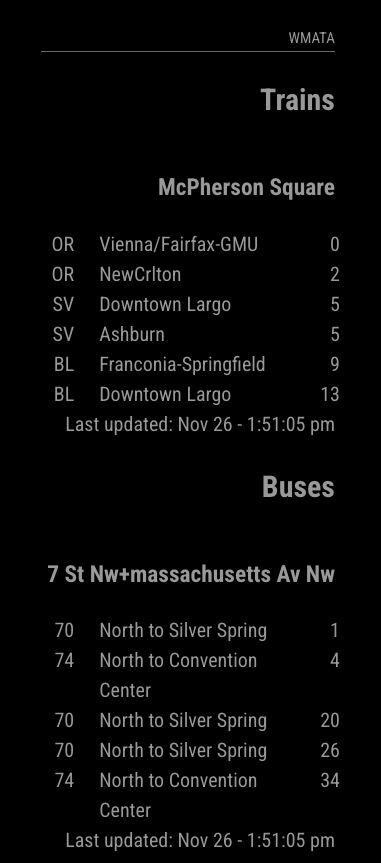

# MMM-WMATA

**MMM-WMATA is a module for [MagicMirror²](https://github.com/MagicMirrorOrg/MagicMirror) that displays rail and bus arrival times from [WMATA](https://wmata.com).

## Description

This module allows you to display WMATA train and bus times with expected arrivals on your MagicMirror.

## Screenshot


## How it Works

After you installed MMM-WMATA you just configure it with the train and bus stations that you'd like to monitor.  You'll need to generate a developer key at [WMATA's website](https://developer.wmata.com/).

For more information see the [Configuration](#configuration) section.

## Installation

Just clone `MMM-WMATA` into the modules folder of your MagicMirror² installation:

```bash
cd ~/MagicMirror/modules
git clone https://github.com/btoconnor/MMM-WMATA
```

## Update

Go to the `MMM-WMATA` folder inside MagicMirror² modules folder and pull the latest version from GitHub:

```bash
cd ~/MagicMirror/modules/MMM-WMATA
git pull
```

Restart MagicMirror² after updating.

## Configuration

In order to use this module, you simply need to provide the `host` `apiKey`, and the `shoppingListID` of the shopping list you'd like to display..

These are the possible options:

<!-- prettier-ignore-start -->
| Option                          | Description    |
|---------------------------------|----------------|
| `apiKey`                        | <p>An API key generated from WMATA's developer portal.</p><p>**REQUIRED** **Type:** `string`<br>**Example:** `"eyhJbcG..."`<br>**Default value:** none</p>|
| `trainStations`                 | <p>A list of train station IDs to fetch times for.  See [here](https://gist.github.com/emma-k-alexandra/72d2a19e3ebd280e9640f4414f063d6b) for a list of codes.</p>|
| `trainUpdateInterval`           | <p>The time in seconds between rail time updates.</p><p>**Type:** `integer`<br>**Example:** `60` (The train times will be refreshed every 60 seconds (1 minute).)<br>**Default value:** `60` (1 minute)<br>**Unit:** `seconds`</p>|
| `showTrainIncidents`            | <p>Whether to show fetch train incident information.</p><p>**Type:** `boolean`<br>**Default value**: `true`</p>|
| `trainIncidentUpdateInterval`   | <p>The time in seconds between train incident updates.</p><p>**Type:** `integer`<br>**Example:** `60` (The train incidents will be refreshed every 60 seconds (1 minute).)<br>**Default value:** `300` (5 minute)<br>**Unit:** `seconds`</p>|
| `busStops`                      | <p>A list of bus stop IDs to fetch times for.</p><p>
| `busUpdateInterval`             | <p>The time in seconds between bus stop updates.</p><p>**Type:** `integer`<br>**Example:** `60` (The bus times will be refreshed every 60 seconds (1 minute).)<br>**Default value:** `60` (1 minute)<br>**Unit:** `seconds`</p>|
| `showEmptyBusStops`             | <p>Whether to show bus stops that don't have expected arrivals.</p><p>**Type:** `boolean`<br>**Example:** `true` (Bus stops will be shown even if there are no currently predicted buses.)<br>**Default value:** `true` (1 minute)</p>|
| `busStopFilterFn`               | <p>A custom function to filter which bus stops are fetched at a given time.</p><p>**Type:** `function`<br>See notes below.<br>**Default value:** All specified buses are fetched at the given interval.<br>**Note**: See below for information on providing a custom function.</p>|
| `busRouteIncidentFilterFn`      | <p>A custom function to filter displaying notifications for a given route.</p><p>**Type:** `function`<br>See notes below. <br>**Default value:** All bus incidents will be shown.</p>|
| `showBusIncidents`              | <p>Whether to show fetch train incident information.</p><p>**Type:** `boolean`<br>**Default value**: `true`</p>|
| `busIncidentUpdateInterval`     | <p>The time in seconds between bus incident updates.</p><p>**Type:** `integer`<br>**Example:** `60` (The bus incidents will be refreshed every 60 seconds (1 minute).)<br>**Default value:** `300` (5 minute)<br>**Unit:** `seconds`</p>|
<!-- prettier-ignore-end -->

Here is an example of an entry in `config.js`. Take note of `mealTypeName` and `mealSortOrder`. Here, we use the `side` meal type as a reminder of things we need to do to prepare for future meals, e.g., thaw meat. `mealTypeName` changes what appears, and `mealSortOrder` moves the side entries to the top of the list for each day.

```javascript
{
    module: "MMM-WMATA",
    header: "WMATA",
    position: "top_left",
    config: {
        apiKey: "eyhJbcG...",
        trainStations: ['C02']
    }
},
```

## Bus Stop Filter Functions
The train and bus APIs work slightly differently.  We can make a single API call with all the list of train stops and parse them locally to show trains per station.
However, the bus stop API works differently - we must make a single API call per stop.  To make matters more complicated, buses tend to have separate stops per direction,
and in many cases will stop at very similar locations, but technically be separate stops even in the same directions.
Many times buses only run to a given "stop" for a few hours a day, even though the line may be active in different directions for different parts of the day.  Providing dozens
of bus stops could easily exhaust the free API limit and most would be checking on bus stops that are not active at a given point during the day.

In order to avoid exhausting the API limit, you can provide a function in your configuration file that will allow you to remove a given bus stop from being
fetched outside of hours of expected operation.  The default function is to fetch all bus stops at the given `busUpdateInterval`.

### Example

Let's say a fictional bus line, the "SCHOOL" line, only operates Monday - Friday from 7am to 9am at a given stop "CORNER".  Refreshing the stop "CORNER" would be useless outside of those hours.

The filter function is provided the current time, and the stationCode, and must return a boolean determining whether we should fetch bus arrivals for this station.

A potential filter function would be the following:

```js
function(now_datetime, stationCode) {
  const day = now_datetime.getDay();
  const hours = now_datetime.getHours();

  const isWeekend = day == 0 || day == 6;
  const isWeekday = !isWeekend;

  if (stationCode == 'CORNER') {
      // CORNER is only used M-F in the morning
      return (isWeekday && (hours > 6) && (hours < 10));
  } else {
      // It is recommended to return true by default if a bus stop isn't
      // explicitly handled.
      return true;
  }
}
```

## Bus Route Incident Filter Functions
Similarly to bus stop filter functions, we can filter incidents for a given route to the ones we're interested in.

### Example:
```javascript
busRouteIncidentFilterFn: (_incidentType, route) => route == 'D33',
````

This function would limit displaying incidents unless the incident affected the "D33" line.


## Special Thanks

I originally attempted to use [MMM-DCMetroTimes](https://github.com/kyle-kelly/MMM-DCMetroTimes), but had some issues with bus times on lines that didn't run throughout the day.  While I ultimately rewrote this plugin from scratch, I referenced the code of this repository during development.
